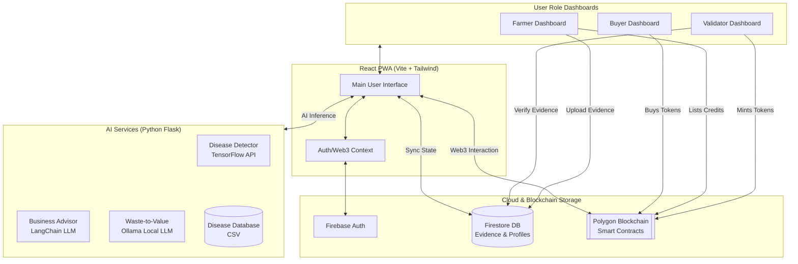

# KrishiSaarthi - Project Documentation

## 1. PROJECT OVERVIEW

### Project Name
**KrishiSaarthi** (Derived from *Krishi* meaning Agriculture and *Saarthi* meaning Charioteer/Guide)

### High-Level Summary
KrishiSaarthi is a "Phygital" (Physical + Digital) agricultural platform designed to bridge the gap between advanced technology and Indian farmers. It serves as a comprehensive ecosystem that combines AI-driven disease detection and business advisory services with a blockchain-based Green Credit Marketplace. The platform empowers farmers to improve crop health, make smart investment decisions, and earn additional income through sustainable farming practices.

### Real-World Problem It Solves
- **Lack of Expertise:** Farmers often struggle to identify crop diseases early, leading to yield loss.
- **Financial Uncertainty:** Poor investment choices in crops or allied businesses often lead to debt.
- **Sustainability Gap:** Sustainable farming practices are encouraged but rarely monetized or transparently rewarded.
- **Market Access:** Farmers lack direct access to corporate buyers for carbon credits.

### Target Users
- **Farmers:** The primary beneficiaries who use the tools for disease detection, advice, and selling green credits.
- **Validators:** Trusted third parties (agronomists, local officials) who verify the farmers' sustainable practices physically and digitally.
- **Buyers:** Corporates or individuals looking to purchase valid green credits to offset their carbon footprint.

### Key Features
- **AI Crop Doctor:** Instant disease diagnosis from leaf photos with treatment suggestions.
- **Business Advisor:** AI chatbot that recommends profitable agricultural businesses based on land, budget, and local conditions.
- **Green Credit Marketplace:** A transparent blockchain platform where farmers trade carbon credits earned via sustainable farming.
- **Role-Based Access:** tailored dashboards for Farmers, Validators, and Buyers.

---

## 2. CORE CONCEPT & IDEA

### Concept in Simple Terms
Imagine a digital assistant that acts as a doctor, financial advisor, and broker for a farmer.
1.  **Doctor:** The farmer takes a photo of a sick plant, and the app tells them what's wrong and how to fix it.
2.  **Advisor:** The farmer asks, "I have 2 acres and ₹50,000, what should I grow?" and the app gives a detailed business plan.
3.  **Broker:** The farmer grows organic food, a validator checks it, and the farmer gets "Green Credits" which they can sell for cash to companies.

### Evolution of the Idea
The project started as a simple disease detection tool. However, we realized that diagnosing a problem isn't enough; farmers need financial stability and incentives to adopt better practices. Thus, the **Business Advisor** was added to help with financial planning, and the **Green Credit Marketplace** was introduced to gamify and monetize sustainability using Blockchain.

### Why This Approach?
- **AI over Manual Inspection:** Manual inspection is slow and expensive. AI scales instantly to millions of users.
- **Blockchain over Centralized Database:** Blockchain ensures that Green Credits are unique, traceable, and cannot be forged. This builds trust with buyers who want to ensure their money actually supports green practices.
- **Web App over Mobile App:** A PWA (Progressive Web App) model ensures accessibility on low-end devices without requiring large downlods.

---

## 3. SYSTEM ARCHITECTURE

### Overall System Flow
1.  **User Interface (Frontend):** The user interacts with the React-based web app.
2.  **Authentication:** User logs in via Firebase Auth; their role (Farmer/Validator/Buyer) determines their dashboard.
3.  **AI Services (Backend):**
    - **Disease Detection:** Image is sent to the Flask API $\rightarrow$ Processed by TensorFlow Model & mapped to CSV Database $\rightarrow$ Result returned.
    - **Advisory:** Chat messages sent to Flask API $\rightarrow$ Processed by LangChain/LLM $\rightarrow$ Context-aware advice returned.
    - **Waste-to-Value:** Waste data processed via Ollama (Local LLM) $\rightarrow$ Structured recycling/processing options returned.
4.  **Database (Firestore):** Stores user profiles, application history, and non-blockchain metadata.
5.  **Blockchain (Smart Contracts):** Handles the minting, transfer, and verification of Green Tokens using Ethereum/Polygon networks.

### Data Flow Diagram


---

## 4. TECH STACK

| Technology | Purpose | Why Chosen? | Alternatives |
| :--- | :--- | :--- | :--- |
| **React (Vite)** | Frontend UI | Component-based, fast updates, excellent ecosystem. | Angular, Vue |
| **Tailwind CSS** | Styling | Rapid development, consistent design system. | Bootstrap, SCSS |
| **Python (Flask)** | Backend API | Essential for running AI/ML models easily. | Django, FastAPI |
| **Firebase** | Auth & DB | Real-time updates, serverless, easy scaling. | AWS, Supabase |
| **TensorFlow** | AI Model | Robust framework for image classification. | PyTorch |
| **Solidity** | Blockchain | Standard for Ethereum Virtual Machine (EVM). | Rust (Solana) |
| **Ethers.js** | Web3 Client | Lightweight library to connect React with Blockchain. | Web3.js |

---

## 5. FOLDER & FILE STRUCTURE

### Root Directory
- **/Frontend:** Contains the React application source code.
- **/Backend:** Contains the Python Flask server and AI models.
- **firebase.json:** Configuration for Firebase Hosting and rules.
- **README.md:** High-level project summary.

### Frontend Structure (`/Frontend/src`)
```
/src
├── /components      # Reusable UI elements (Buttons, Cards, Layouts)
│   ├── ProtectedRoute.tsx  # Handles role-based access control
│   └── Layout.tsx          # Main page wrapper with Navbar/Sidebar
├── /contexts        # React Contexts for global state
│   ├── AppContext.tsx      # User profile and global app state
│   └── BlockchainContext.tsx # Web3 connection management
├── /pages           # Main view components corresponding to Routes
│   ├── FarmerDashboard.tsx
│   ├── CropDiseaseDetector.tsx
│   └── ...
├── /lib             # Utility libraries (utils, constants)
├── App.tsx          # Main Router configuration
└── main.tsx         # Entry point, mounts React to DOM
```

### Backend Structure (`/Backend`)
```
/Backend
├── app.py           # Main Flask application entry point
├── /services        # Business logic modules
│   ├── /Disease Detector  # ML models and prediction logic
│   └── /Business Advisor  # Chatbot logic
├── /uploads         # Temp storage for processing images
└── requirements.txt # Python dependencies
```

---

## 6. DETAILED CODE EXPLANATION

### Feature: Disease Detection
**Module:** `Backend/app.py` & `services/detector.py`
- **Logic:**
    1.  Frontend uploads an image to `/api/disease/detect`.
    2.  `app.py` saves the file temporarily.
    3.  Calls `detector_predict()` which pre-processes the image (resizing, normalization).
    4.  Feeds it to the loaded `.h5` deep learning model.
    5.  Returns the class with highest probability + confidence score.
    6.  Fetches treatment info from `crop_disease_data.csv`.

### Feature: Business Advisor Chat
**Module:** `Backend/app.py` & `services/krishi_chatbot.py`
- **Logic:**
    1.  Frontend sends user message + session ID.
    2.  Backend retrieves the `KrishiSaarthiAdvisor` instance for that session.
    3.  The request typically passes through an LLM (Large Language Model) chain or rule-based logic to generate advice tailored to the farmer's profile (land size, budget).

### Feature: Role-Based Routing
**Module:** `Frontend/components/ProtectedRoute.tsx`
- **Logic:** Checks the user's role stored in `AppContext`. If the user matches `allowedRoles` (e.g., 'farmer'), it renders the child component. If not, it redirects to the login or home page.

---

## 7. DATABASE DESIGN (Firestore)

**Type:** NoSQL Document Store

**Collections:**
1.  `users`
    - `uid` (string): Unique Auth ID
    - `role` (string): 'farmer' | 'validator' | 'buyer'
    - `name`, `email`, `phone`
2.  `projects` (Green Credit Applications)
    - `farmerId`: Reference to user
    - `cropType`: string
    - `status`: 'pending' | 'verified' | 'rejected'
    - `images`: Array of evidence URLs

**Why NoSQL?** The data structure for agricultural projects can vary (different crops have different parameters), making a flexible schema ideal.

---

## 8. API FLOW

### Backend API (Flask)
| Endpoint | Method | Purpose | request | response |
| :--- | :--- | :--- | :--- | :--- |
| `/api/disease/detect` | `POST` | Detect disease from image | `multipart/form-data` (image) | JSON (disease, cure) |
| `/api/business-advisor/init` | `POST` | Start a chat session | JSON (user profile) | JSON (session_id) |
| `/api/business-advisor/chat` | `POST` | Send message to bot | JSON (msg, session_id) | JSON (reply) |

---

## 9. SECURITY CONSIDERATIONS

1.  **Authentication:** Strict reliance on Firebase Auth. No custom password handling.
2.  **Role Verification:** Frontend checks are convenience only. **Critical:** Firestore security rules must be set to ensure a 'farmer' cannot read 'validator' data.
3.  **Input Sanitization:** `werkzeug.utils.secure_filename` is used in Python to prevent file upload attacks.
4.  **Environment Variables:** Blockchain keys and Firebase config are stored in `.env` and never committed to Git.

---

## 10 PERFORMANCE AND SCALABILITY

- **Frontend:** Built with Vite for extremely fast loading. React components are lazy-loaded where possible.
- **Backend:** Flask is lightweight. For scaling, this should be moved to a production-grade WSGI server (like Gunicorn) behind Nginx.
- **AI Models:** Currently loaded in memory. For scale, these should be served via TensorFlow Serving or a dedicated microservice to prevent blocking the main web server.

---

## 11. DEPLOYMENT DETAILS

The project follows a decoupled deployment strategy:

- **Frontend:** Hosted on **Firebase Hosting**.
    - Build: `npm run build`
    - Deploy: `firebase deploy`
    - Why? Fast CDN content delivery globally.

- **Backend:** (Local/Cloud VM)
    - Ideally deployed on a platform like AWS EC2, Google Cloud Run, or Heroku.
    - Requires Python environment and access to model files.

---

## 12. CONFIGURATION & ENV FILES

### Frontend `.env`
Create this file in `/Frontend`:
```env
VITE_FIREBASE_API_KEY=xxx
VITE_FIREBASE_AUTH_DOMAIN=xxx
VITE_FIREBASE_PROJECT_ID=xxx
VITE_FIREBASE_STORAGE_BUCKET=xxx
VITE_FIREBASE_MESSAGING_SENDER_ID=xxx
VITE_FIREBASE_APP_ID=xxx
```

### Backend Configuration
Managed via `app.py` config variables (like `UPLOAD_FOLDER`). Ensure `requirements.txt` is up to date.

---

## 13. HOW TO RUN LOCALLY

### Prerequisites
1.  Node.js installed.
2.  Python 3.8+ installed.
3.  Git installed.

### Step-by-Step

**1. Clone and Setup Frontend:**
```bash
cd Frontend
npm install
# Ensure .env is created as above
npm run dev
```

**2. Setup Backend:**
```bash
cd Backend
python -m venv venv
# Windows: venv\Scripts\activate
# Mac/Linux: source venv/bin/activate
pip install -r requirements.txt
python app.py
```

**3. Common Errors:**
- *ModuleNotFound:* Run `pip install -r requirements.txt` again.
- *CORS Error:* Ensure `flask_cors` is installed and enabled in `app.py`.

---

## 14. FUTURE IMPROVEMENTS

1.  **Smart Contract Audits:** Before real money usage, contracts need professional auditing.
2.  **Offline Mode:** Enhance PWA capabilities for farmers with poor connectivity.
3.  **Vernacular Voice Support:** Allow farmers to speak in their dialect instead of typing.
4.  **IoT Integration:** Auto-fetch soil data from sensors instead of manual input.

---

## 15. LEARNING OUTCOMES

By working on this project, developers gain skills in:
- **Full Stack Integration:** Connecting React with Python AI services.
- **Web3 Development:** Implementing practical blockchain use-cases beyond cryptocurrency.
- **Applied AI:** Deploying Deep Learning models in a consumer-facing app.
- **System Design:** Architecting a multi-role platform with varying security needs.

---
*This document serves as the internal truth for the KrishiSaarthi project.*

---

## 16. TECHNICAL DEEP DIVE (Q&A)

### Q1: How are languages translated?
**Answer:**
The translation system is built using a **custom React Context approach** rather than an external library like `i18next` to keep the app lightweight.
1.  **Storage:** All translation strings are stored in a static dictionary object `translations` within `Frontend/src/contexts/AppContext.tsx`. Each key (e.g., `'app.name'`) maps to an object containing values for `'en'`, `'hi'`, and `'mr'`.
2.  **State Management:** The current language (`'en' | 'hi' | 'mr'`) is stored in the `AppContext` state.
3.  **Consumption:** Components consume this via a helper function `t(key)`. When `t('welcome')` is called, it checks `translations['welcome'][currentLanguage]`. If a translation is missing, it falls back to the English key.
4.  **Updates:** Changing the language in the Settings or Profile page updates the global context state, causing all components using `t()` to re-render instantly with the new text.

### Q2: How is the Business Advisor working?
**Answer:**
The Business Advisor operates using a **Hybrid Intelligence Model**:
1.  **Rule-Based Logic (Frontend):** For instant feedback, the `businessData.ts` file contains pre-defined metrics (Investment, Profit, ROI) for 15+ business types. When a user selects a business, the UI immediately renders these "static" cards.
2.  **AI-Powered Chat (Backend):** When the user clicks "Ask Chatbot" or "Start Assessment":
    *   The Frontend sends the user's profile (Land, Budget, Risk Appetite) to the Backend API (`/api/business-advisor/init`).
    *   The Backend initializes a `KrishiSaarthiAdvisor` session.
    *   It uses a Large Language Model (LLM) or structured logic to generate personalized advice.
    *   **Context Awareness:** If the user comes from the Disease Detector, the detected disease info is passed to the Advisor, allowing it to suggest crops that are resistant to that specific disease or how to recover financial losses.

### Q3: How is the Blockchain working?
**Answer:**
The Blockchain layer acts as a **Trust & Verification Layer** for the Green Credit Marketplace. It is built on **Ethereum (EVM)** principles using **Solidity** smart contracts and connected via **Ethers.js**.
1.  **Smart Contracts:**
    *   `Token Contract`: An ERC-20 standard token representing "Green Credits".
    *   `Registry Contract`: Stores project metadata (Farmer ID, Project Type, Status).
    *   `Marketplace Contract`: Allows trading of credits for ETH/Tokens.
2.  **Flow:**
    *   **Step 1 (Submission):** Farmer uploads sustainability evidence (photos/location) to **Firebase Firestore**.
    *   **Step 2 (Verification):** A Validator reviews the Firestore evidence and confirms accuracy.
    *   **Step 3 (Minting):** Upon approval, the `verifyAndMint` function is called on the Registry contract, minting tokens to the farmer's wallet.
    *   **Step 4 (Trading):** The farmer lists credits on the Marketplace contract; buyers purchase them atomically.
3.  **Network:** The app currently connects to the **Sepolia Testnet** for zero-cost testing.

### Q4: How is the Disease Detector working?
**Answer:**
The Disease Detector uses **Deep Learning (CNN)** to analyze plant images.
1.  **Input:** The user uploads an image via the React Frontend.
2.  **Processing:** The image is sent to the Flask Backend (`/api/disease/detect`) as `multipart/form-data`.
3.  **Inference:**
    *   The backend loads a pre-trained TensorFlow/Keras model (`plant_disease_model.h5`).
    *   The image is resized and normalized to match the model's input requirements (usually 224x224 pixels).
    *   The model outputs a probability distribution across 38+ disease classes.
4.  **Lookup:** The predicted class index is mapped to a human-readable name. The system then queries `crop_disease_data.csv` to find the specific cure, chemical control, and home remedies for that disease.
5.  **Result:** The final JSON response containing the Disease Name, Confidence Score, and Treatment Plan is sent back to the Frontend for display.

### Q5: How is everything linked?
**Answer:**
The system follows a **Microservices-like Architecture** where distinct components communicate via APIs and Shared State.
1.  **Frontend $\leftrightarrow$ Backend:**
    *   Linked via **REST APIs**. The React app sends HTTP POST requests to the Flask server for heavy computations (AI) and data retrieval.
    *   *Example:* `BusinessAdvisor.tsx` $\rightarrow$ `fetch('http://localhost:5000/api/business-advisor/chat')`.
2.  **Frontend $\leftrightarrow$ Firebase:**
    *   Linked via **Firebase SDK**. Authentication state and user profile data (Firestore) are synchronized in real-time using listeners in `AppContext.tsx`.
3.  **Frontend $\leftrightarrow$ Blockchain:**
    *   Linked via **Ethers.js Provider**. The app injects itself into the browser's wallet (MetaMask) to sign transactions. It doesn't query a central server for blockchain data; it queries the decentralized node directly.
4.  **Unified Experience:**
    *   The **Context API** (`AppContext`, `BlockchainContext`) acts as the "glue" inside the Frontend. It ensures that a logged-in user's name (from Firebase) is visible on the Blockchain Dashboard, and their Wallet Balance (from Blockchain) is visible on the Business Page.

### Q6: How does Dark Mode work?
**Answer:**
Dark mode is implemented using a **CSS-Class Strategy** combined with **Tailwind CSS**.
1.  **Configuration:** The `tailwind.config.js` is set to `darkMode: 'class'`. This tells Tailwind to apply styles prefixed with `dark:` (e.g., `dark:bg-gray-900`) *only* when the `dark` class is present on a parent element.
2.  **Context:** The `ThemeContext.tsx` provider manages the current theme state (`'light'` or `'dark'`).
3.  **Persistence:** When the app loads, it checks `localStorage` for a saved preference.
4.  **Toggling:** When the user clicks the toggle button:
    *   The state updates.
    *   The `dark` class is strictly added or removed from the `<html>` (root) element: `document.documentElement.classList.toggle('dark', isDark)`.
    *   The new preference is saved to `localStorage`.

### Q7: How is user access controlled?
**Answer:**
We use a **Client-Side Protection wrapper**:
1.  **Component:** `ProtectedRoute.tsx` acts as a gatekeeper for private routes.
2.  **Logic:** It consumes the `user` object from `AppContext`.
    *   **Check 1 (Auth):** If `user` is null, it immediately redirects to `/login`.
    *   **Check 2 (Role):** It accepts an `allowedRoles` array props (e.g., `['farmer']`). If `user.role` is not in this list, it redirects to the home page.
3.  **Security Note:** While this prevents normal users from seeing unauthorized pages, vital data is further protected by **Firestore Security Rules** on the backend, ensuring that even if a user bypasses the UI, they cannot read restricted data.

### Q8: What makes the application fast?
**Answer:**
Several architectural choices contribute to the speed:
1.  **Vite Build Tool:** Unlike Create-React-App (Webpack), Vite serves source code over native ESM, making development feedback instant and production builds highly optimized.
2.  **Local State for Translations:** Instead of fetching translation files from a server, they are bundled directly into the JS chunk (`AppContext.tsx`). This means 0ms latency when switching languages.
3.  **Optimized Assets:** The app uses SVG icons (Lucide-React) instead of heavy image files where possible, and Tailwind generates minimal CSS bundles by purging unused styles.
4.  **No unnecessary re-renders:** The architecture separates `BlockchainContext` (heavy Web3 logic) from `AppContext` (UI state), preventing blockchain updates from causing lag in the UI.

---

## 17. FILE DICTIONARY (What Each File Does)

This index explains the specific purpose of every key file in the repository to help developers navigate the codebase.

### Frontend - Pages (`/Frontend/src/pages`)
| File Name | Description | Key Features |
| :--- | :--- | :--- |
| **`Landing.tsx`** | The public home page. | Hero section with 3D elements, feature highlights, and 'Get Started' call-to-action. |
| **`AuthPage.tsx`** | Combined Login and Signup interface. | Handles Toggle between Login/Signup, Role Selection (Farmer/Validator/Buyer), and form validation. |
| **`FarmerDashboard.tsx`** | Main control center for Farmers. | Displays "Your Impact" stats, quick links to Disease Detector, Business Advisor, and Green Credits. |
| **`ValidatorDashboard.tsx`** | Interface for Validators/Verifiers. | Fetches pending credit requests, allows viewing evidence images, and buttons to Approve (Mint) or Reject claims. |
| **`BuyerDashboard.tsx`** | Marketplace view for Buyers. | Lists available carbon credits for sale (from Blockchain), allows filtering, and executing purchase transactions. |
| **`CropDiseaseDetector.tsx`** | UI for the AI Disease Detection feature. | Handles image upload, sends it to Backend API, and displays the returned disease diagnosis + treatment. |
| **`BusinessAdvisor.tsx`** | The Hybrid Advisory System. | **Tab 1 (Form):** Collects user data (budget, land). **Tab 2 (Results):** Shows static business cards. **Tab 3 (Chat):** Live AI chat interface. |
| **`GreenCredit.tsx`** | Credit management page for Farmers. | Allows farmers to submit new sustainability claims (photos/description) and view their earned credits. |

### Frontend - Contexts (`/Frontend/src/contexts`)
| File Name | Description | Key Features |
| :--- | :--- | :--- |
| **`AppContext.tsx`** | The "Brain" of the Frontend. | Manages global State: User Profile (from Firebase), Current Language (English/Hindi/Marathi), and Translation Logic. |
| **`BlockchainContext.tsx`** | The "Bridge" to Web3. | Connects to MetaMask, listens for account changes, and exposes Contract instances (Token, Registry, Marketplace) to the app. |
| **`ThemeContext.tsx`** | UI Theme Manager. | Toggles between Light/Dark mode and persists preference in `localStorage`. |

### Frontend - Services (`/Frontend/src/services`)
| File Name | Description | Key Features |
| :--- | :--- | :--- |
| **`blockchain.ts`** | Core Web3 Logic library. | Functions to `connectWallet`, `verifyAndMint`, `buyFromMarketplace`. Wraps Ethers.js complexity. |
| **`contracts.ts`** | Smart Contract Config. | Contains the **ABI** (Application Binary Interface) JSONs and deployed **Contract Addresses** for Sepolia network. |

### Backend (`/Backend`)
| File Name | Description | Key Features |
| :--- | :--- | :--- |
| **`app.py`** | Main API Entry Point. | A Flask server that defines routes: `/api/disease/detect`, `/api/business-advisor/chat`. Orchestrates requests. |
| **`services/detector.py`** | AI Inference Module. | Loads the `.h5` model, pre-processes images (resizing/normalization), and runs prediction. |
| **`services/krishi_chatbot.py`** | Advisory Logic Module. | Contains the `KrishiSaarthiAdvisor` class. Generates business advice based on farmer inputs using logic or LLM. |
| **`services/crop_disease_data.csv`**| Static Knowledge Base. | A database file mapping "Disease Name" $\rightarrow$ "Cure/Chemical/Home Remedy". Used by `app.py` to enrich AI results. |
| **`plant_disease_model.h5`** | The Brain (AI Model). | A binary file containing the pre-trained Convolutional Neural Network (CNN) weights for disease classification. |

---


### Q6: How does Dark Mode work?
**Answer:**
Dark mode is implemented using a **CSS-Class Strategy** combined with **Tailwind CSS**.
1.  **Configuration:** The `tailwind.config.js` is set to `darkMode: 'class'`. This tells Tailwind to apply styles prefixed with `dark:` (e.g., `dark:bg-gray-900`) *only* when the `dark` class is present on a parent element.
2.  **Context:** The `ThemeContext.tsx` provider manages the current theme state (`'light'` or `'dark'`).
3.  **Persistence:** When the app loads, it checks `localStorage` for a saved preference.
4.  **Toggling:** When the user clicks the toggle button:
    *   The state updates.
    *   The `dark` class is strictly added or removed from the `<html>` (root) element: `document.documentElement.classList.toggle('dark', isDark)`.
    *   The new preference is saved to `localStorage`.

### Q7: How is user access controlled?
**Answer:**
We use a **Client-Side Protection wrapper**:
1.  **Component:** `ProtectedRoute.tsx` acts as a gatekeeper for private routes.
2.  **Logic:** It consumes the `user` object from `AppContext`.
    *   **Check 1 (Auth):** If `user` is null, it immediately redirects to `/login`.
    *   **Check 2 (Role):** It accepts an `allowedRoles` array props (e.g., `['farmer']`). If `user.role` is not in this list, it redirects to the home page.
3.  **Security Note:** While this prevents normal users from seeing unauthorized pages, vital data is further protected by **Firestore Security Rules** on the backend, ensuring that even if a user bypasses the UI, they cannot read restricted data.

### Q8: What makes the application fast?
**Answer:**
Several architectural choices contribute to the speed:
1.  **Vite Build Tool:** Unlike Create-React-App (Webpack), Vite serves source code over native ESM, making development feedback instant and production builds highly optimized.
2.  **Local State for Translations:** Instead of fetching translation files from a server, they are bundled directly into the JS chunk (`AppContext.tsx`). This means 0ms latency when switching languages.
3.  **Optimized Assets:** The app uses SVG icons (Lucide-React) instead of heavy image files where possible, and Tailwind generates minimal CSS bundles by purging unused styles.
4.  **No unnecessary re-renders:** The architecture separates `BlockchainContext` (heavy Web3 logic) from `AppContext` (UI state), preventing blockchain updates from causing lag in the UI.

---


