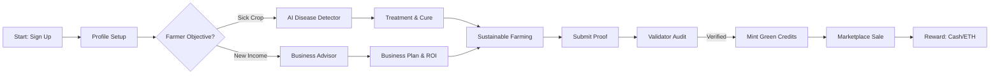

# User Workflow & Journey: KrishiSaarthi

A workflow diagram illustrates the logical steps a user takes through your platform to achieve a goal.

---

## Recommended Workflow Apps

1. **[Eraser.io](https://www.eraser.io/)** (AI Design): The fastest way to turn the prompt below into a beautiful "User Journey" or "Workflow" map.
2. **[Whimsical](https://whimsical.com/)**: Exceptional for flowcharts and user journeys. It has a very clean, "friendly" aesthetic that works well for agricultural projects.
3. **[FigJam](https://www.figma.com/figjam/)**: Great for collaborative whiteboarding and creating colorful, sticky-note style workflows.
4. **[Mermaid Live Editor](https://mermaid.live/)**: Use the code below for a precise, technical flow.

---

## The "End-to-End Journey" AI Prompt

Copy and paste this into **Eraser.io** or **ChatGPT**:

> **Prompt:** "Create a user workflow diagram for KrishiSaarthi. The journey should follow these 6 phases:
> 
> 1. **Onboarding:** Farmer signs up -> role selection -> profile setup (region, budget, land).
> 2. **AI Diagnosis:** Farmer notices crop issue -> uploads photo -> AI identifies disease -> provides cure & pesticide advice.
> 3. **Smart Planning:** Farmer enters 'Business Advisor' -> AI analyzes profile -> suggests 3 profitable business ideas with ROI analysis.
> 4. **Sustainable Action:** Farmer adopts organic/water-saving practices -> collects photo/GPS evidence.
> 5. **Validation:** Validator reviews evidence on dashboard -> performs digital/physical check -> Approves claim.
> 6. **Value Exchange:** Blockchain mints Green Credit Tokens -> Farmer lists credits in Marketplace -> Buyer purchases credits with ETH/Tokens.
> 
> **Style:** Use a linear horizontal flow or a circular 'Loop' to show the continuous cycle of farming improvement. Use icons for 'Smartphone', 'AI Brain', 'Shield', and 'Blockchain Token'. Colors: Earthy tones (Brown, Green, Sun-Yellow)."

---

## Mermaid.js Code (For Technical Flow)

---

## PPT Presentation Context
- **The "Full Circle":** Emphasize that KrishiSaarthi isn't just a tool, it's a **Complete Life Cycle** for the farmer—from fixing a problem to making more money.
- **Role Interaction:** Show how the Farmer and Validator interact; this demonstrates the "Phygital" trust mechanism.
- **Conversion:** Highlight that the final step (Green Credits) turns hard work into liquid assets.
