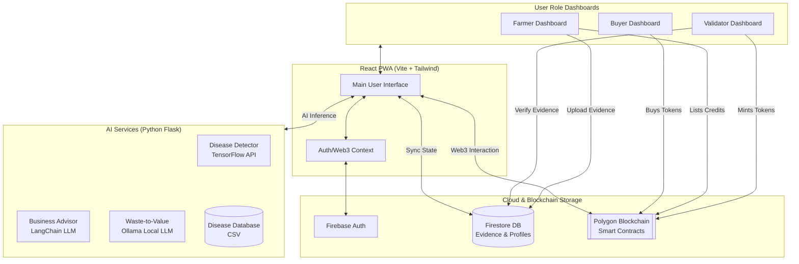

# Technical Diagrams: KrishiSaarthi

For a professional technical flow diagram, you can use **Mermaid.js** (code-based) or **AI-assisted diagram tools**.

---

## Recommended Diagram Apps

1. **[Mermaid Live Editor](https://mermaid.live/)**: Best for quick, clean, and version-control-friendly diagrams. Paste the code below to see it instantly.
2. **[Eraser.io](https://www.eraser.io/)**: (Highly Recommended) An AI-powered whiteboard. You can paste the "AI Prompt" below into their "AI Diagram" feature to get a beautiful, professional layout.
3. **[Lucidchart](https://www.lucidchart.com/) / [Miro](https://miro.com/)**: Standard industry tools for manual or template-based diagramming.
4. **[ChatGPT (with Diagrams Plugin)](https://chatgpt.com/)**: You can provide the technical overview and ask it to "Generate a Mermaid diagram for this architecture."

---

## Option 1: AI Diagram Prompt (For Eraser.io or ChatGPT)

> **Prompt:** "Create a technical architecture diagram for KrishiSaarthi. The flow should show:
> 1. **User Personas:** Farmer, Validator, and Buyer with their respective dashboards.
> 2. **Frontend Layer:** React Vite PWA using Context API for state and Ethers.js for Web3.
> 3. **Services Layer (Flask Backend):** 
>    - AI Disease Detector (TensorFlow Model + CSV Knowledge Base)
>    - AI Business Advisor (LangChain + LLM Chat)
>    - Waste-to-Value Engine (Ollama Local LLM)
> 4. **Infrastructure Layer:** 
>    - Firebase Auth & Firestore (Storing User Profiles & Evidence Photos)
>    - Polygon Blockchain (Smart Contracts for Green Credits)
> 5. **Data Flow:** 
>    - Farmers upload evidence to Firestore.
>    - Validators review Firestore evidence and Mint credits on Blockchain.
>    - Buyers purchase Credits from Blockchain via the Marketplace."

---

## Option 2: Mermaid.js Code (Copy-Paste to Mermaid Live)

Copy and paste this into the [Mermaid Live Editor](https://mermaid.live/):

---

## Diagram Design Tips
- **Color Coding:** Use Green for "Organic/Sustainable" elements, Blue for "AI/Compute", and Purple/Indigo for "Blockchain/Trust".
- **Icons:** If using Miro or Lucidchart, add icons for 'Cloud', 'AI Brain', 'Mobile Phone', and 'Ethereum Logo' to make it visual rather than just boxes.
- **Direction:** For PPTs, a **Left-to-Right** flow is often easier to read on a slide than Top-to-Bottom.
