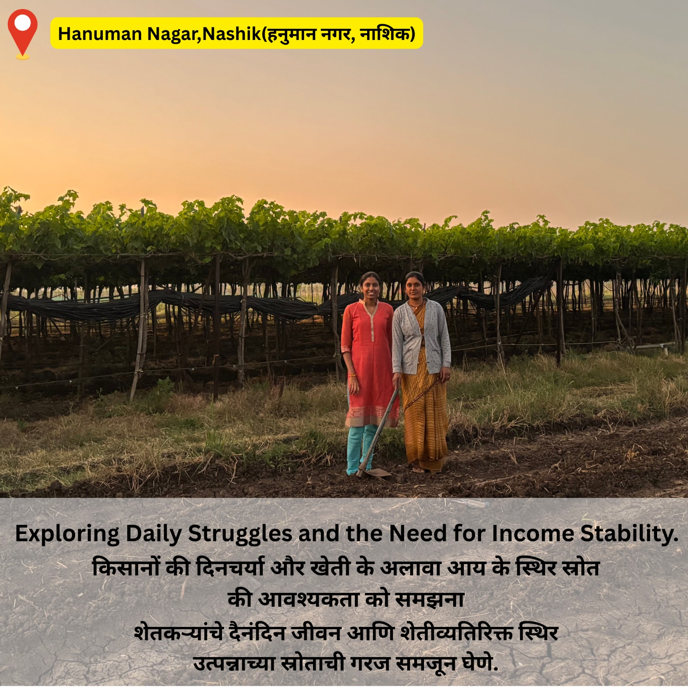

<div align="center">

# KrishiSaarthi (कृषीसारथी)
### Empowering Agriculture with AI & Blockchain


[](https://krishisaarthi-59c47.web.app)

KrishiSaarthi is a next-generation "Phygital" (Physical + Digital) platform designed to revolutionize Indian agriculture. It combines cutting-edge AI for disease detection and business advisory with a blockchain-based Green Credit Marketplace to empower farmers, ensure transparency, and promote sustainable practices.

</div>

---

## Key Features

### 1. AI-Powered Disease Detector ("Crop Doctor")
- **Instant Diagnosis**: Farmers can upload photos of their crops.
- **AI Analysis**: Our advanced Deep Learning model (MobileNetV2/ResNet) identifies diseases with high accuracy.
- **Actionable Advice**: Provides immediate treatment recommendations, pesticide suggestions, and preventive measures.
- **Multilingual Support**: Available in English, Hindi, and Marathi.
- **Q&A Chatbot**: An interactive assistant to answer specific queries about the disease detected or the crop.

### 2. Business Advisor (Smart Investment)
- **Personalized Recommendations**: Suggests profitable agricultural businesses (e.g., Beekeeping, Mushroom Farming, Organic Vegetables) based on the farmer's budget, land size, and region.
- **ROI Calculation**: Provides detailed cost-benefit analysis and estimated profits using AI.
- **Q&A Chatbot**: An interactive assistant to answer specific queries about starting new ventures.

### 3. Green Credit Marketplace (Blockchain)
- **Tokenize Sustainability**: Farmers earn "Green Credits" (ERC-20 tokens) for verified sustainable practices (Organic Farming, Water Conservation).
- **Validator Network**: Third-party validators verify the claims physically and digitally.
- **Transparent Trading**: Buyers (Corporates/Individuals) can purchase these credits directly from farmers to offset their carbon footprint.
- **Smart Contracts**: Powered by Ethereum/Polygon smart contracts ensures secure and immutable transactions.

### 4. Waste to Value (Eco-Processing)
- **Crop Waste Analysis**: Farmers input their crop residue details (e.g., Banana pseudostems, Rice straw).
- **AI Recommendations**: Uses **Ollama (Local LLM)** to suggest products that can be made from the waste (e.g., Fibers, Bio-gas, Compost).
- **Process Guidance**: Step-by-step instructions on how to process the waste and sell the final product.

### 5. Role-Based Ecosystem
- **Farmer**: Scan crops, get advice, apply for green credits.
- **Validator**: Verify farmer applications, mint credits (Admin capability).
- **Buyer**: Browse verified projects and purchase green credits.

---

## Validation Phase Zero: Ground Research
**"Building with the User, not just for them."**

We conducted extensive on-ground research to validate the problem statement. Our team visited local farms, markets, and rural communities to:
- **Meet Farmers**: We interacted directly with farmers to understand their daily pain points and needs.
- **Analyze Real Businesses**: We observed existing agricultural businesses to identify gaps in the supply chain and credit systems.
- **Validate Problems**: This "Phase Zero" confirmed the necessity for a tech-enabled, trust-based solution like KrishiSaarthi.

### Research Gallery
| | | | |
|:---:|:---:|:---:|:---:|
|  |  |  |  |
|  |  |  |  |

---

## Technology Stack

| Layer | Technologies |
|-------|--------------|
| **Frontend** | React, TypeScript, Vite, Tailwind CSS, Framer Motion |
| **Backend AI** | Python, TensorFlow/Keras, LangChain, Ollama (Local LLM), Flask/FastAPI |
| **Blockchain** | Solidity, Hardhat, Ethers.js, MetaMask |
| **Database** | Firebase Firestore (User Profiles, Role Management) |
| **Auth** | Firebase Authentication |
| **Deployment** | Firebase Hosting |

---

## Getting Started

### Prerequisites
- **Node.js** (v18+)
- **Python** (v3.9+)
- **MetaMask Wallet** (Browser Extension)
- **Git**

### 1. Clone the Repository
```bash
git clone https://github.com/SanTiwari07/KrishiSaarthi.git
cd KrishiSaarthi
```

### 2. Frontend Setup
Navigate to the frontend folder and install dependencies:
```bash
cd Frontend
npm install
```

> **Note**: For detailed frontend documentation, features, and folder structure, please refer to [Frontend/README.md](./Frontend/README.md).

**Environment Variables (.env)**:
Create a `.env` file in the `Frontend` directory with your Firebase config:
```env
VITE_FIREBASE_API_KEY=your_api_key
VITE_FIREBASE_AUTH_DOMAIN=your_project.firebaseapp.com
VITE_FIREBASE_PROJECT_ID=your_project_id
VITE_FIREBASE_STORAGE_BUCKET=your_bucket
VITE_FIREBASE_MESSAGING_SENDER_ID=your_sender_id
VITE_FIREBASE_APP_ID=your_app_id
```

Start the development server:
```bash
npm run dev
```

### 3. Backend Setup (AI Services)
Navigate to the backend folder:
```bash
cd Backend
python -m venv venv
# Activate: .\venv\Scripts\activate (Windows) or source venv/bin/activate (Mac/Linux)
pip install -r requirements.txt
# Note: Streamlit is now included in requirements for the Waste-to-Value module
```
Start the application (ensure your AI models are downloaded/linked properly).

---

## Usage Guide

### For Farmers
1. **Login/Signup** as a Farmer.
2. Go to **Disease Detector** to scan plants.
3. Visit **Business Advisor** for investment ideas.
4. Go to **Green Credits** -> **Apply** to submit proof of sustainable farming.

### For Validators
1. **Login** with a Validator account.
2. Connect your **MetaMask Admin Wallet**.
3. View **Pending Requests** on the Dashboard.
4. **Approve/Reject** applications based on evidence (Updates Blockchain).

### For Buyers
1. **Login** as a Buyer.
2. Go to the **Marketplace**.
3. Browse "Verified" green projects.
4. **Buy Credits** using crypto tokens to support farmers.

---

## Team
Our dedicated team working to bridge the gap between technology and agriculture:
- **Kanishka Salgude**
- **Srujan Satav**
- **Sanskar Tiwari**

## Contributing
We welcome contributions! Please fork the repo, create a feature branch, and submit a PR.

## License
This project is licensed under the MIT License.

---
<div align="center">

*Built with love for Indian Farmers*

</div>
